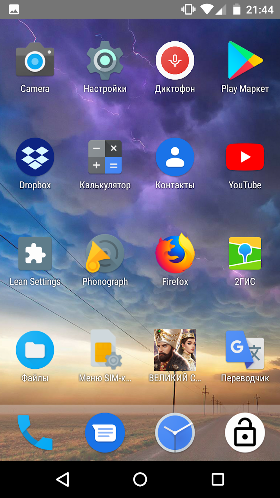
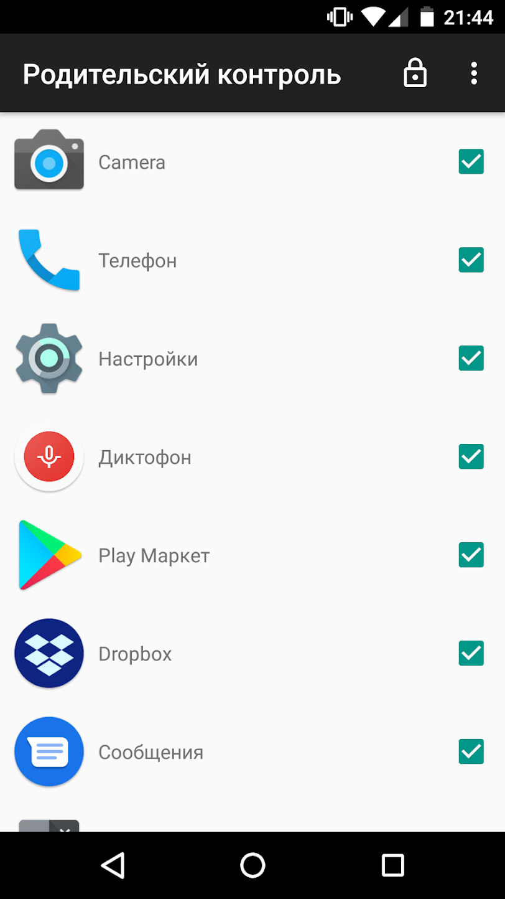

# Диплом

Здесь содержится код к моей дипломной работе. Kid's Shell for Android - **прототип** приложения по обеспечению родительского контроля для Android. Принцип работы: родитель выбирает, какими приложениями можно пользоваться ребёнку, придумывает пароль, запускает песочницу и отдаёт устройство ребёнку. Если ребёнок попытается каким-то образом открыть запрещённое приложение (например, через уведомление), то его вернёт обратно в песочницу.

Т.к. это прототип, то есть много проблем, в том числе:
* Для механизма блокировки нужно специальное разрешение, но всплывающее окно о предоставлении разрешения не реализовано.
* Механизм блокировки легко обойти, например, перезагрузкой телефона.
* Приложение выглядит адекватно только на маленьких экранах.

Скачать: [Google Play](https://play.google.com/store/apps/details?id=ru.edu.masu.kids_shell)

Скриншоты:

